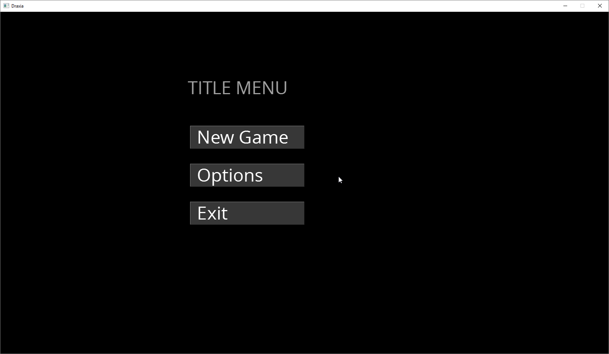

# Draxia

This game project I was mostly focused on creating game states that are managed by a state manager and to create several GUI-controls.The game has a main menu with the buttons "New Game", "Options" and "Exit". When the user clicks on a button, then another game state is loaded in. The "Options" menu is pretty much functional. It reads and writes to the Settings-file as needed. The "New Game" button loads in the "game play state", and will run the game. This game has features like: A FPS-counter, Window/Fullscreen mode and is DPI-aware. I had to make a resource manager to make a central facility for obtaining game resources. As the project grew, I need to use precompiled header. This made the compilation time to be reduced quite a lot. SDL2 and SDL2_gpu was used. SDL2 for window and events. SDL2_gpu is a wrapper library for SDL2 to use OpenGL.

Tags: C++, Game Engine, SDL2, SDL_gpu, PCH, FSM, UI, Menu, Project
